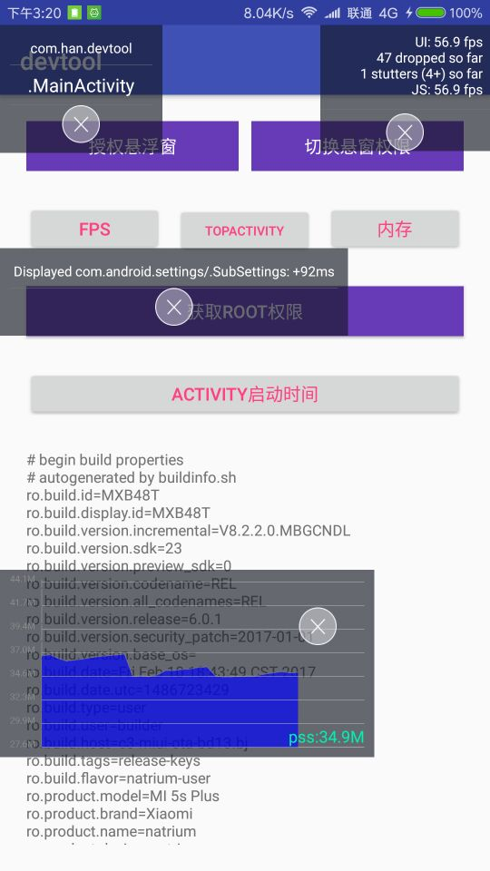
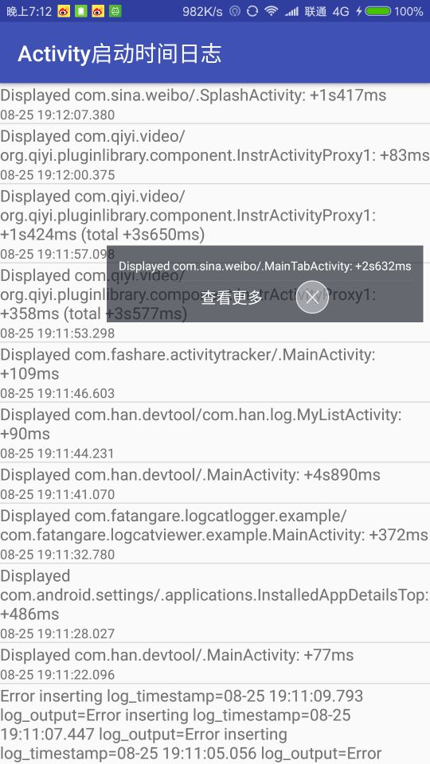
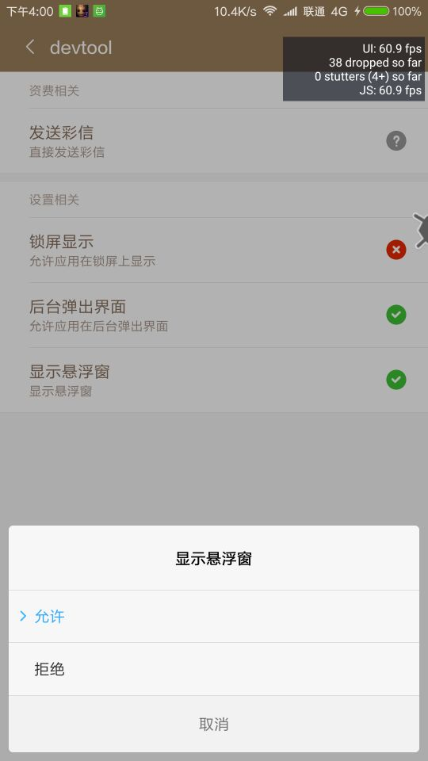

# AndroidMonitor
Android开发辅助工具

### download url 下载地址
https://github.com/jackuhan/AndroidMonitor/releases/download/1.0.0/app-debug.apk

### fps monitor
显示手机帧率和累计丢帧数

### topActivity
显示最顶层activity名称,app包名,辅助开发使用。

### activity启动时间日志
显示activity启动时间,需要root权限。

### cpu和内存使用率记录
正在开发中。

打开fpsmonitor需要打开悬浮窗权限。

# 作者联系方式
  QQ:1196681436
  Weibo:http://www.weibo.com/u/1693069642

欢迎提出意见，提交代码。